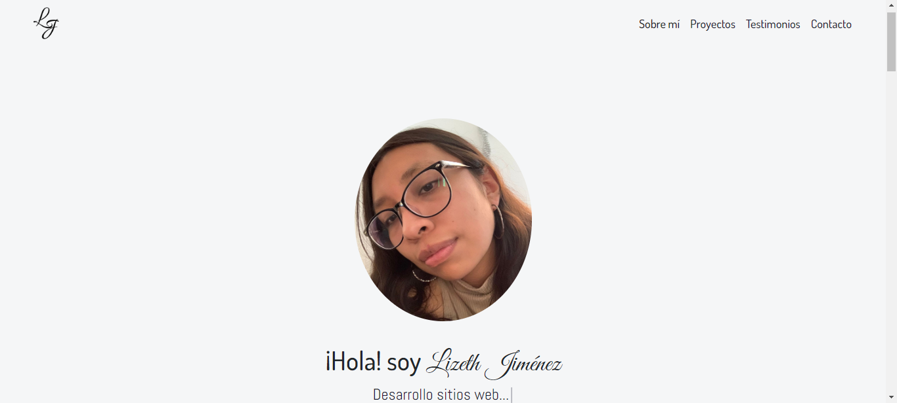
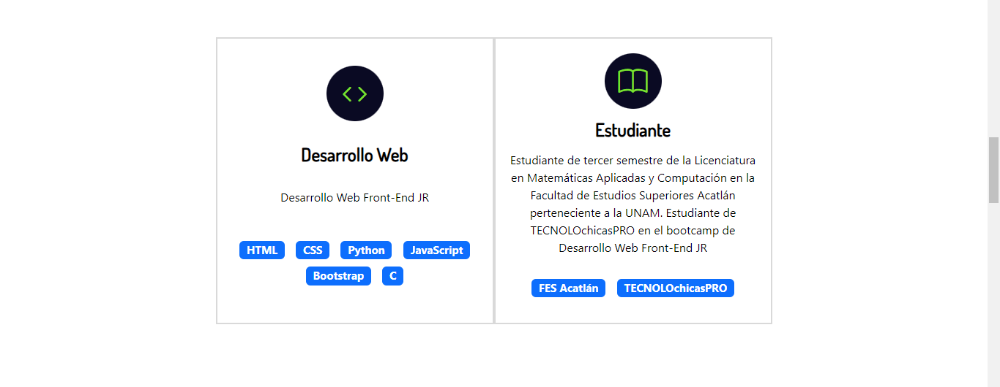
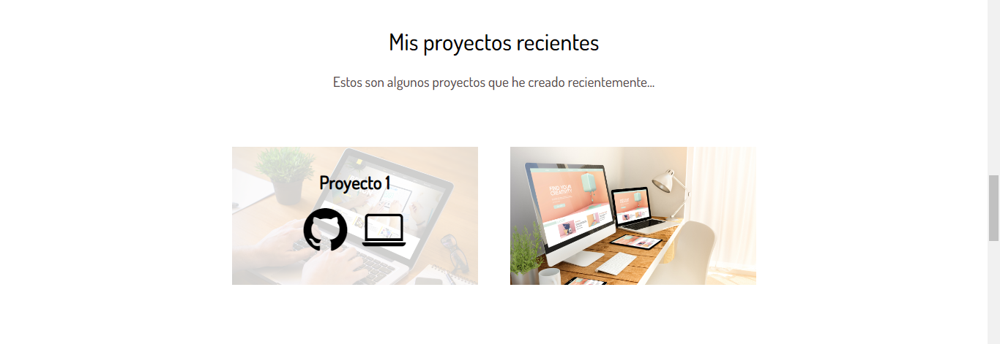
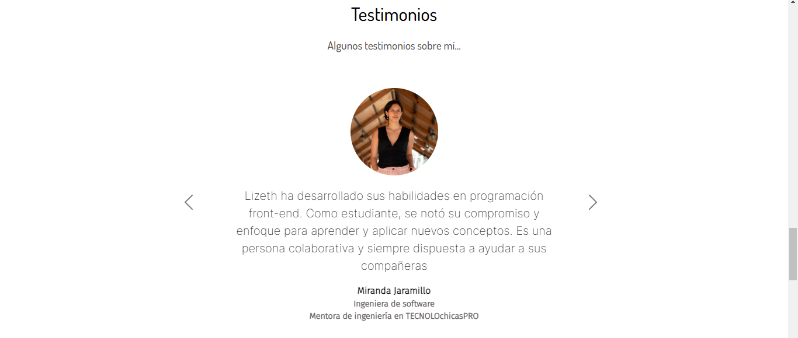
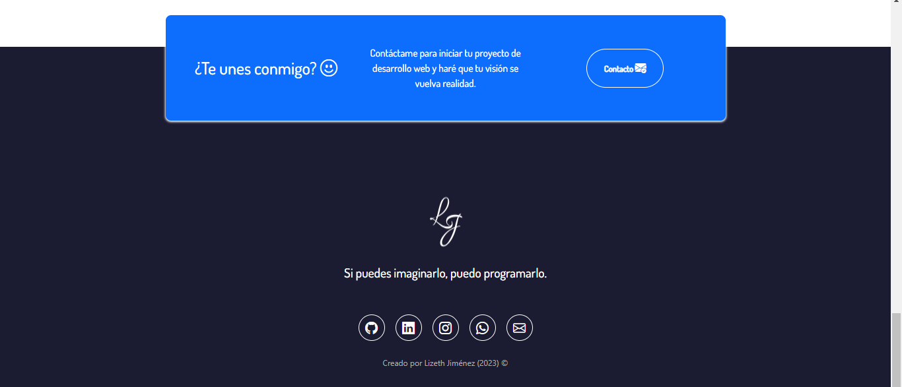

# Portafolio Adaptable (Responsive) con Bootstrap 5

Este proyecto fue creado para el bootcamp TECNOLOchicasPRO 👩🏽‍💻, es una página web adaptable a dispositivos de distintos tamaños (este tipo de sitio web se conoce en inglés como "responsive"). 

El propósito de esta página web es mostrar mi portafolio de proyectos. Incluye los cursos que he tomado, habilidades e idiomas, experiencia, proyectos, testimonios y formas de contacto. 

Dividida en 5 secciones:

Primera parte de la página web:

Experiencia:

Proyectos:

Testimonios:

Contacto:

## Tecnologías

Esta página web fue creada con:

* HTML5
* CSS3
* JavaScript 
* Bootstrap 5

Además, se incluyeron **Google Fonts** para personalizar la fuente y **Bootstrap icons** para incorporar íconos como flechas y logos de redes sociales populares. 

## Español

El texto de la página web está escrito en español, al igual que las clases y atributos personalizados. Las clases relacionadas con Bootstrap se incluyeron en inglés.

